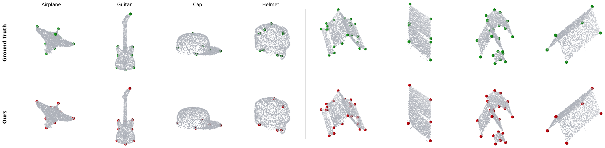
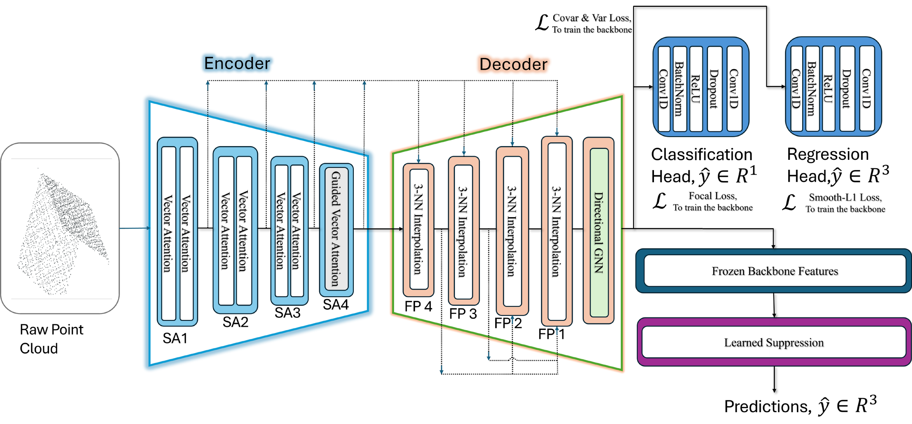
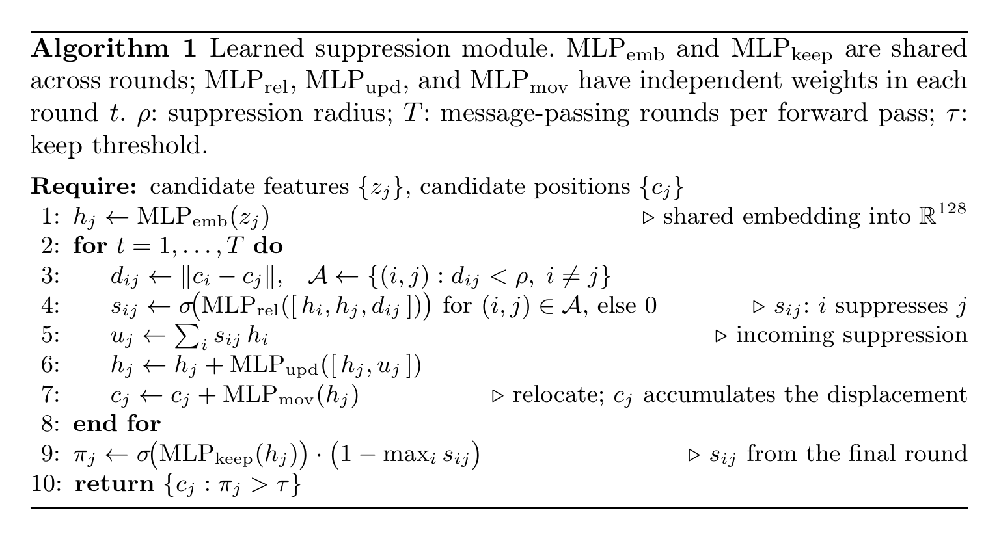

<div align="center">

# Learned Suppression for 3D Keypoint Detection with a Graph-Transformer Backbone

**Batuhan Arda Bekar · Can Sarı · Hüseyin Can Gülkan · Barış Özcan**

**ACCV 2026**

[](#citation)
[](https://building3d.ucalgary.ca/)
[](https://github.com/qq456cvb/KeypointNet)
[](https://www.python.org/)
[](https://pytorch.org/)
[](LICENSE)

Official PyTorch implementation of a 3D keypoint detector whose final selection step is **learned**: a small graph network over keypoint candidates decides which to keep, which to suppress, and where to move the remaining ones.



<sub>One detector for semantic object landmarks (KeypointNet, left) and structural roof corners from airborne LiDAR (Building3D, right). Ground truth in green, our predictions in red.</sub>

</div>

---

## News

- **2026-09**: Code released.
- **2026-09**: Paper accepted to ACCV 2026.

## Abstract

Detecting 3D keypoints is a long-standing challenge in computer vision. Most detectors end with a heuristic post-processing step that is not learned. We propose a 3D keypoint detector that improves on this step with a learned suppression module, paired with a Point Transformer backbone that we extend with a directional graph neural network. The module is a graph network over candidates that learns which to keep, which to suppress, and how to relocate the remaining ones. Paired with three backbones, it improves over DBSCAN and greedy non-maximum suppression, and because it operates on candidate features rather than raw geometry, the same formulation applies to both structural and semantic keypoints. Our model surpasses the per-category trained KeypointDETR on 12 of 16 KeypointNet categories, attains the best Corner F1 on the Building3D Entry-Level benchmark, and remains competitive with BWFormer on the larger Tallinn split.

## Contents

- [Method](#method)
- [Results](#results)
- [Installation](#installation)
- [Data Preparation](#data-preparation)
- [Training](#training)
- [Evaluation](#evaluation)
- [Repository Structure](#repository-structure)
- [Citation](#citation)
- [Acknowledgements](#acknowledgements)

## Method

The pipeline has two stages. A **Graph-Transformer backbone** predicts, for every point, a keypoint probability, an offset to the nearest keypoint, and a refined feature. High-confidence points then vote for candidate keypoints, and the **learned suppression module** turns the candidates into the final keypoints.

<p align="center">
  
</p>

**Encoder.** Four set abstraction stages (SA1 to SA4) downsample the cloud with farthest point sampling and aggregate k nearest neighbors with vector attention Point Transformer blocks. Each block conditions attention on the neighbor offset $`\Delta p_{ij}`$ through a **spectral positional encoding**: a 64 dimensional descriptor $`g_i`$ of the neighborhood predicts per axis multipliers $`\mu_i`$ for the octave bands $`\omega^{\mathrm{base}} = (\pi, 2\pi, \dots, 2^{L-1}\pi)`$, and a projection $`\psi`$ turns the directional and radial Fourier features into a bias $`\delta_{ij}`$ and a gate $`\delta^{gate}_{ij}`$:

```math
\omega_i = \omega^{\mathrm{base}} \odot \mu_i, \qquad
(\delta_{ij}, \delta^{gate}_{ij}) = \psi\big([\gamma^{\mathrm{dir}}_{ij}, \gamma^{\mathrm{rad}}_{ij}, g_i]\big),
```

```math
w_{ij} = \phi\big(\delta^{gate}_{ij} \odot (q_i - k_j) + \delta_{ij}\big), \qquad
\mathrm{out}_i = \sum_j \mathrm{softmax}_j(w_{ij}) \odot (v_j + \delta_{ij}).
```

At SA4, during training only, the attention logits receive a log prior from the soft keypoint labels $`y_j`$ (learning using privileged information). At inference the block is plain vector attention.

```math
w'_{ij} = w_{ij} + \log(y_j + 0.01), \qquad y_i = \mathrm{clip}\big(\exp(-d^{\min}_i / r), 0, 1\big).
```

**Decoder and directional GNN.** Four feature propagation stages (FP4 to FP1) with UNet3+ full scale skip connections restore full resolution. A directional GNN then refines the per point features with signed messages over the feature contrast, edge direction and edge length to the k nearest neighbors (Euclidean on Building3D, geodesic on KeypointNet):

```math
e_{ij} = [f_i - f_j, \mathrm{dir}_{ij}, \mathrm{dist}_{ij}], \qquad
a_{ij} = \mathrm{softmax}_j\Big(\tfrac{\mathrm{MLP}_a(e_{ij})}{\sqrt{C}}\Big), \qquad
f'_i = f_i + \sigma(\lambda)\, \mathrm{MLP}_o\Big(\sum_j a_{ij}\, \mathrm{MLP}_m(e_{ij})\Big).
```

**Learned suppression.** Every point with probability above 0.10 casts a vote at $`p_i + r\,\hat{\Delta}_i`$. The votes are denoised by two rounds of mean shift and reduced to candidates by greedy NMS. Each candidate feature $`z_j`$ pools 10 statistics of its voters, the probability weighted mean of their refined features, and the mean feature of its 4 nearest candidates. The module (0.15M parameters) then runs $`T`$ rounds of message passing over candidates within radius $`\rho`$, suppressing and relocating them:

<p align="center">
  
</p>

**Training.** The backbone is trained end to end with

```math
L = L_{cls} + L_{off} + 0.1\, L_{var} + 0.01\, L_{cov}, \qquad
L_{cls} = \mathbb{E}_i\Big[(1 + \beta e^{-d^{\min}_i / r})(1 - p_{t,i})^{\gamma}\, \mathrm{BCE}(x_i, y_i)\Big],
```

where $`L_{off}`$ is a Smooth L1 loss on the offsets of points within $`r`$ of a keypoint, $`L_{var}`$ and $`L_{cov}`$ are the VICReg variance and covariance terms on the refined features, $`\beta = 2`$, and $`\gamma`$ anneals from 2.0 to 1.05 over the first 100 epochs. The suppression module is trained afterwards on the frozen backbone: candidates are matched to ground truth keypoints by Hungarian assignment, matched candidates are trained to be kept and moved onto their keypoint, and unmatched ones to be suppressed.

<details>
<summary><b>Layer configuration</b></summary>

| Stage | Points | Grouping | Output channels |
|-------|--------|----------|-----------------|
| SA1 | N → 640 | kNN, K = 16 and 32 | 64 + 128 = 192 |
| SA2 | 640 → 320 | kNN, K = 16 and 32 | 128 + 256 = 384 |
| SA3 | 320 → 160 | kNN, K = 16 and 32 | 256 + 512 = 768 |
| SA4 | 160 → 40 | kNN, K = 32, training time log prior | 1024 |
| FP4 | 40 → 160 | UNet3+ skips from SA1, SA2, SA3 | 512 |
| FP3 | 160 → 320 | UNet3+ skips from SA1, SA3, SA4, FP4 | 256 |
| FP2 | 320 → 640 | UNet3+ skips from SA2, SA3, SA4, FP3, FP4 | 128 |
| FP1 | 640 → N | UNet3+ skips from all stages | 128 |
| Directional GNN | N | k = 16 | 128 |

Both heads are `Conv1d(128, 64) → BN → ReLU → Dropout(0.5) → Conv1d(64, k)` with k = 1 (keypoint logit) and k = 3 (offset). The backbone has 22.7M parameters.

</details>

## Results

**Building3D** (test split, online evaluator):

| Method | Entry-Level ACO ↓ | CP ↑ | CR ↑ | CF1 ↑ | Tallinn ACO ↓ | CP ↑ | CR ↑ | CF1 ↑ |
|--------|:---:|:---:|:---:|:---:|:---:|:---:|:---:|:---:|
| Point2Roof | 0.30 | 66.0 | 48.0 | 56.0 | 0.390 | 65.0 | 30.0 | 41.0 |
| PBWR | **0.22** | **97.0** | 85.0 | 91.0 | 0.222 | **98.5** | 68.8 | 81.0 |
| BWFormer | | | | | **0.204** | 94.9 | 82.7 | **88.4** |
| **Ours** | **0.22** | 96.5 | **90.1** | **93.2** | 0.216 | 92.3 | **83.7** | 87.8 |

**KeypointNet** (test split, Hungarian mIoU at ε = 0.10 in %, KeypointDETR protocol). A single model for all 16 categories against the per category KeypointDETR:

| Method | Air. | Bat. | Bed | Bot. | Cap | Car | Cha. | Gui. | Hel. | Kni. | Lap. | Mot. | Mug | Ska. | Tab. | Ves. |
|--------|---|---|---|---|---|---|---|---|---|---|---|---|---|---|---|---|
| KeypointDETR | 91.37 | 71.37 | 70.83 | 87.22 | 79.43 | **94.29** | 91.89 | 93.96 | **85.05** | 63.12 | 99.11 | 87.52 | **96.62** | 92.28 | **98.05** | 59.97 |
| **Ours** | **96.93** | **90.83** | **87.61** | **90.68** | **91.74** | 92.25 | **94.58** | **97.84** | 52.36 | **91.12** | **99.65** | **92.28** | 85.55 | **94.25** | 95.96 | **77.35** |

**Learned suppression versus heuristic post processing** on the same backbone (test splits):

| Backbone | Post processing | Entry-Level CF1 | Tallinn CF1 | KeypointNet mIoU | KeypointNet CD ↓ |
|----------|-----------------|:---:|:---:|:---:|:---:|
| Ours | Greedy NMS | 90.70 | 85.10 | 84.25 | 0.080 |
| Ours | DBSCAN | 89.00 | 83.60 | 79.67 | 0.085 |
| Ours | **Learned suppression** | **93.20** | **87.80** | **92.01** | **0.055** |
| PointNet++ | DBSCAN | 82.30 | 80.40 | 70.92 | 0.111 |
| PointNet++ | **Learned suppression** | **87.00** | **84.90** | **74.99** | 0.115 |
| DGCNN | DBSCAN | 78.40 | 74.90 | 70.68 | 0.100 |
| DGCNN | **Learned suppression** | **84.90** | **81.70** | **77.87** | **0.099** |

The full tables, including the component ablation, are in the paper.

## Installation

```bash
conda create -n lsupp python=3.9 -y
conda activate lsupp

# PyTorch: pick the build matching your CUDA version at https://pytorch.org
pip install torch==2.6.0 --index-url https://download.pytorch.org/whl/cu124

pip install -r requirements.txt
pip install wandb   # optional, for --wandb logging
```

Everything is implemented in plain PyTorch, so no CUDA extensions need to be compiled. Inference, suppression training and KeypointNet backbone training (batch 14, about 10.5 GB) fit on a single 12 GB GPU. Building3D backbone training needs about 0.8 GB per sample at 2,560 points; on a 12 GB GPU, pass `--batch_size 12` to `train.py`.

## Data Preparation

Datasets are expected under `data/` by default; every path can be changed in the config files. On first use each sample is normalized to the unit sphere, its labels are computed, and the result is cached under `data/cache/` (once, in parallel).

### Building3D

Download [Building3D](https://building3d.ucalgary.ca/) (Entry-Level and/or Tallinn) and arrange each release as

```
data/building3d/entry_level/          data/building3d/Tallinn/
├── train/                             ├── train/
│   ├── xyz/        <id>.xyz           │   ├── xyz/
│   └── wireframe/  <id>.obj           │   └── wireframe/
└── test/                              └── test/
    └── xyz/        <id>.xyz               └── xyz/
```

- `.xyz` files hold one point per line: `x y z r g b a intensity`. Colors are divided by 256 and intensity by 65535.
- `.obj` wireframes hold the roof corners (`v x y z`) and edges (`l i j`). File names are numeric scan ids.
- The validation split is a hold out of the training scans listed in [`splits/`](splits): 1,138 scans for Entry-Level and 3,260 for Tallinn. Set `data.val_ids` to another file (or remove it) to change this.
- Entry-Level is a subset of the Tallinn scans. To build it from the Tallinn release, point `data.root_dir` to the Tallinn folder and `data.train_ids` to the list of Entry-Level training ids.

Each point carries XYZ, RGBA, intensity and four scale channels (the log of the normalization scale and the three extents of the normalized scene), so C = 12.

### KeypointNet

Download the ShapeNet point clouds, annotations and official splits from the [KeypointNet repository](https://github.com/qq456cvb/KeypointNet):

```
data/keypointnet/
├── pcds/          <synset id>/<model id>.pcd
├── annotations/   airplane.json, bathtub.json, ...
└── splits/        train.txt, val.txt, test.txt
```

Each point carries XYZ, RGB and PCA normals, so C = 9. Soft labels and offsets use the geodesic distance to the nearest keypoint, and the directional GNN uses geodesic neighborhoods; both are computed with Dijkstra on a kNN graph and cached.

## Training

Training has two stages: the backbone first, then the learned suppression module on top of the frozen backbone.

```bash
# Stage 1: backbone (writes output/entry/last.pth)
python train.py --config configs/building3d_entry.yaml --output_dir output/entry

# Stage 2: learned suppression (writes output/entry/suppression.pth)
python train_suppression.py --config configs/building3d_entry.yaml \
    --backbone output/entry/last.pth --output_dir output/entry
```

Use `configs/building3d_tallinn.yaml` or `configs/keypointnet.yaml` for the other benchmarks. Stage 1 accepts `--resume <checkpoint>`, `--epochs`, `--batch_size` and `--wandb`. Stage 2 selects the epoch and the keep threshold τ with the best mean per scene F1 on the validation split and stores τ in the checkpoint.

| Setting | Building3D | KeypointNet |
|---------|-----------|-------------|
| Points per sample | 2,560 | 2,048 |
| Label radius r | 0.05 | 0.10 |
| Backbone epochs / batch size | 300 / 32 | 100 / 14 |
| Backbone optimizer | AdamW, OneCycleLR with peak 3e-3, weight decay 0.01, gradient clipping 1.0 | same |
| Augmentation | random flips, rotation about z | random flips, rotation about z, point jitter |
| Suppression epochs / batch size | 60 / 8 | 60 / 4 |
| Suppression optimizer | Adam, lr 1e-3, weight decay 1e-4, cosine schedule | same |
| Candidates | vote threshold 0.10, NMS radius 0.05, 4 random rotations per training scene | same |
| Module | T = 2 rounds, ρ = 0.08, hidden size 128 | same |

## Evaluation

```bash
# Validation split with ground truth: predictions + metrics
python test.py --config configs/building3d_entry.yaml \
    --backbone output/entry/last.pth --suppression output/entry/suppression.pth --split validation

# KeypointNet test split: per category mIoU and Chamfer distance
python test.py --config configs/keypointnet.yaml \
    --backbone output/kpn/last.pth --suppression output/kpn/suppression.pth --split test
```

Predictions are saved as one `.npz` per sample (`keypoints` in the normalized frame, `keypoints_world` in the original coordinates, and `scores`), and the metrics as JSON.

| Argument | Default | Description |
|----------|---------|-------------|
| `--postproc` | `learned` | `learned`, `nms` (candidate generation only) or `dbscan` (threshold 0.3, eps 0.05) |
| `--keep_threshold` | from checkpoint | keep threshold τ of the learned suppression module |
| `--tta` | from config | rotation angles about z, e.g. `0,90,180,270` (Building3D) or `0` (KeypointNet) |
| `--min_votes` | from config | a keypoint must be found in at least this many rotations |

**Metrics.** On Building3D, predicted and ground truth corners are matched one to one by the Hungarian algorithm in the normalized frame of each scene, and a match within 0.1 is a true positive; ACO is the mean distance of the true positives, and CP, CR and CF1 are precision, recall and F1, averaged over scenes. On KeypointNet we follow the KeypointDETR protocol: Hungarian IoU at distance thresholds 0.00 to 0.10 and the symmetric Chamfer distance, averaged over the test shapes of each category.

**Building3D test server.** The Building3D test sets have no public ground truth. Run `test.py --split test`, then package the predictions for the [online evaluator](https://building3d.ucalgary.ca/):

```bash
python make_submission.py --pred_dir output/predictions/building3d_test_learned --zip submission.zip
```

## Repository Structure

```
├── configs/
│   ├── building3d_entry.yaml      # data, model, training, suppression and inference settings
│   ├── building3d_tallinn.yaml
│   └── keypointnet.yaml
├── splits/                        # Building3D validation hold outs (scan ids)
├── ls3d/
│   ├── models/
│   │   ├── backbone.py            # Graph-Transformer backbone
│   │   ├── layers.py              # set abstraction, UNet3+ feature propagation
│   │   ├── point_transformer.py   # vector attention, spectral positional encoding, SA4 prior
│   │   ├── directional_gnn.py     # directional GNN
│   │   ├── suppression.py         # learned suppression module (Algorithm 1)
│   │   └── ops.py                 # FPS, kNN, interpolation
│   ├── data/                      # Building3D and KeypointNet loaders, geodesic distances
│   ├── losses/                    # focal, offset and variance/covariance losses
│   ├── postprocess/               # candidate generation, NMS/DBSCAN baselines, TTA
│   ├── evaluation/                # Building3D and KeypointNet metrics
│   └── utils/
├── train.py                       # stage 1: backbone
├── train_suppression.py           # stage 2: learned suppression
├── test.py                        # inference and evaluation
└── make_submission.py             # Building3D online evaluator package
```

## Citation

If you find this work useful, please cite:

```bibtex
@inproceedings{bekar2026learned,
  title     = {Learned Suppression for 3D Keypoint Detection with a Graph-Transformer Backbone},
  author    = {Bekar, Batuhan Arda and Sar{\i}, Can and G{\"u}lkan, H{\"u}seyin Can and {\"O}zcan, Bar{\i}{\c{s}}},
  booktitle = {Proceedings of the Asian Conference on Computer Vision (ACCV)},
  year      = {2026}
}
```

## Acknowledgements

This work builds on the following projects; we thank their authors for making them available.

- [Building3D](https://building3d.ucalgary.ca/) (Wang et al., ICCV 2023): dataset, data format and evaluation protocol.
- [KeypointNet](https://github.com/qq456cvb/KeypointNet) (You et al., CVPR 2020): dataset and splits.
- [KeypointDETR](https://www.ecva.net/papers/eccv_2024/papers_ECCV/papers/09481.pdf) (Jin et al., ECCV 2024): KeypointNet evaluation protocol.
- [PointNet++](https://arxiv.org/abs/1706.02413) (Qi et al., NeurIPS 2017), via the [PyTorch implementation](https://github.com/yanx27/Pointnet_Pointnet2_pytorch) by Xu Yan.
- [Point Transformer](https://arxiv.org/abs/2012.09164) (Zhao et al., ICCV 2021), [UNet 3+](https://arxiv.org/abs/2004.08790) (Huang et al., ICASSP 2020), [VICReg](https://arxiv.org/abs/2105.04906) (Bardes et al., ICLR 2022).
- [Learning non-maximum suppression](https://arxiv.org/abs/1705.02950) (Hosang et al., CVPR 2017).

## License

This project is released under the [MIT License](LICENSE). For questions or problems, please open an issue.
